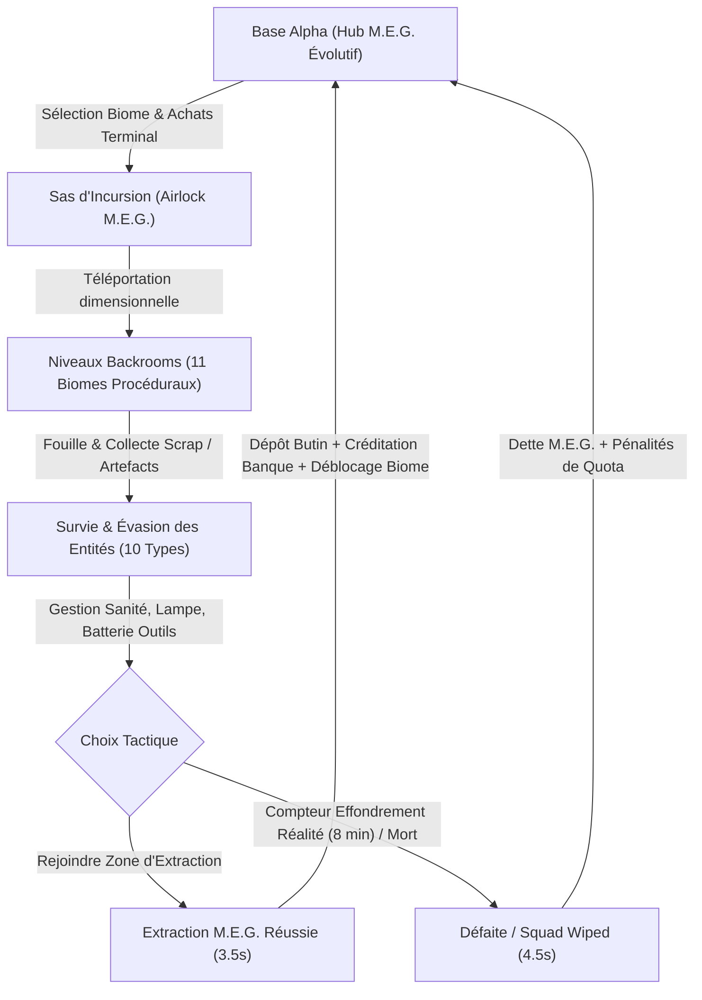

# M.E.G. : RECLAMATION (Echoes of the Liminal)

[](https://www.unrealengine.com/)
[]()
[]()
[]()
[]()

> **Horreur d'extraction coopérative scientifique (1-4 joueurs) dans les espaces liminaux des Backrooms.**
> *Module C++ officiel : `MEG_Reclamation`*

---

## 1. Vision & Philosophie

Dans **M.E.G. : RECLAMATION**, vous n'incarnez pas des soldats surentraînés, mais des **"Récupérateurs" (Scavengers)** employés par le M.E.G. (*Major Explorer Group*). Votre mission consiste à pénétrer des niveaux instables, extraire des artefacts et des ressources critiques, et remplir un quota de cycle pour éponger votre dette et maintenir le Hub opérationnel.

### Philosophie centrale & Parité AAA (R.E.P.O. + Escape the Backrooms + Escape Together)
- **Aucune arme à feu** : la confrontation directe est impossible. Vous survivez grâce à des outils analogiques de maintenance, d'écholocalisation et de temporisation (stroboscope, micro-ondes sonique, spray d'eau d'amande, leurre audio, scanner LIDAR, autoinjecteur d'adrénaline).
- **Pillage Fluide dans le Sac à Dos (`[E]`) & Mains Libres** : Le butin est rangé instantanément dans le sac à dos tactique M.E.G. Vos mains restent 100% libres à tout moment pour utiliser vos lampes, seringues, scanners et outils. Pas d'encombrement visuel ni de portage physique ralenti : notification toast vert néon (`+140 CR RECOLTES DANS LE SAC`), head-bobbing immersif et sprint toujours véloce (pénalité de poids plafonnée).
- **Puzzles Environnementaux & Pannes Électriques (Style Escape the Backrooms)** : claviers de sécurité à 4 chiffres (`ALiminalKeypadActor`), disjoncteurs muraux (`ALiminalBreakerActor`) et coupures de courant d'urgence "Lights Out" plongeant le complexe dans l'obscurité totale.
- **Found-Footage Bodycam 1998 (Style Escape Together)** : viseur caméscope analogique avec témoin `● REC` clignotant, horodatage vintage `04.SEP.1998`, timecode magnétique et autoinjecteur réanimateur pour réanimer les équipiers décédés.
- **Réseau Server-Authoritative Strict** : aucune variable critique de gameplay (santé, sanité, poids, inventaire, mort, extraction) n'est décidée côté client.

---

## 2. Boucle de Gameplay Principale (Game Loop)



1. **Cycle de Mission Limité dans le Temps** :
   - Horloge d'effondrement de réalité (`RealityCollapseTimer` calibrée à 8 minutes / 480 secondes).
   - Alertes sonores et visuelles d'effondrement à 60s et 15s.
   - Effondrement instantané de la réalité et anéantissement de l'escouade si le temps expire avant l'extraction.
2. **Extraction Sécurisée** :
   - Déclenchement au sas/zone d'extraction `AExtractionZone`.
   - Séquence de sécurisation de 3.5 secondes avec transmission radio d'urgence.
   - Dépôt de tout le butin transporté, conversion en crédits bancaires via `ULiminalGameInstance`, déblocage séquentiel du biome suivant et transition fluide vers la Base Alpha.
3. **Échec de Mission & Dette M.E.G.** :
   - En cas d'élimination de l'escouade (`SquadWiped`), déclenchement d'un compte à rebours de défaite (4.5 secondes).
   - Application d'une dette de quota selon les règles strictes du Major M.E.G. et rapatriement d'urgence à la base.

---

## 3. Démarrage Rapide

### Prérequis
- **Unreal Engine 5.8**
- **Visual Studio 2022** (avec la charge de travail *Développement de jeux en C++* et le compilateur MSVC v143+).

### Ouverture et Initialisation
1. Cloner ou ouvrir le projet à l'emplacement `f:\MEG_Reclamation`.
2. Ouvrir le fichier de projet [MEG_Reclamation.uproject](file:///f:/MEG_Reclamation/MEG_Reclamation.uproject).
3. **Génération initiale des assets** :
   Une fois l'Éditeur Unreal ouvert, appuyez sur la touche `~` (console de commande) et exécutez :
   ```text
   MEG.BuildFullGame
   ```
   *Cette commande génère la DataTable `DT_LootItems` (12 types d'objets), les contextes Enhanced Input `IMC_Scavenger` / `IA_*`, et les Behavior Trees IA sous `/Game/`.*

### Cartes Officielles Disponibles (`Content/Maps/`)
- **[Content/Maps/Lvl_Hub_BaseAlpha.umap](file:///f:/MEG_Reclamation/Content/Maps/Lvl_Hub_BaseAlpha.umap)** : Le Hub opérationnel permanent du M.E.G. (Terminaux logistiques, Sas d'incursion, 3 paliers d'évolution visuelle et lumineuse de la base).
- **[Content/Maps/Lvl_Level0_Massive.umap](file:///f:/MEG_Reclamation/Content/Maps/Lvl_Level0_Massive.umap)** : Expédition colossale dans le Niveau 0 (Preset *Mega Expedition* : 64x64, 36 salles, 50 loots, population de monstres doublée).
- **[Content/Maps/Lvl_Level37_Poolrooms.umap](file:///f:/MEG_Reclamation/Content/Maps/Lvl_Level37_Poolrooms.umap)** : Labyrinthe aquatique immaculé (Preset *Grand Labyrinthe* : carrelage céramique 50x50cm hyper-réfléchissant, ambiance bleutée, présence de Jerry).
- **[Content/Maps/Lvl_LevelRun_Gauntlet.umap](file:///f:/MEG_Reclamation/Content/Maps/Lvl_LevelRun_Gauntlet.umap)** : Épreuve de course effrénée en milieu hospitalier sous éclairage d'urgence rouge sang.
- **[Content/Maps/Lvl_Loop.umap](file:///f:/MEG_Reclamation/Content/Maps/Lvl_Loop.umap)** : Boucle d'extraction complète (Base Alpha → Incursion → Dépose → Extraction).
- **[Content/Maps/Lvl_ProcGen.umap](file:///f:/MEG_Reclamation/Content/Maps/Lvl_ProcGen.umap)** : Banc d'essai universel de génération procédurale instantanée.

---

## 4. Contrôles & Gameplay (Enhanced Input)

| Action | Touche (Clavier / Souris) | Description |
|---|---|---|
| **Déplacement** | `Z Q S D` / `W A S D` | Déplacement du récupérateur. Vitesse freinée par le poids porté (jusqu'à 60 kg). |
| **Caméra / Regard** | `Souris` | Orientation de la vue et ciblage de la lampe frontale. |
| **Saut** | `Espace` | Franchissement d'obstacles (consomme de l'endurance). |
| **Sprint** | `Shift Gauche` | Accélération vive (endurance dynamique, pénalité de poids plafonnée pour rester agile). |
| **Ramasser Butin** | `Touche E` | Récolte instantanée dans le sac à dos M.E.G. (mains 100% libres, toast HUD néon). |
| **Lancer / Déposer** | `Touche G` / `Clic Droit` | Option de projection si un objet est manipulé (leurre acoustique à l'impact). |
| **Manuel de Terrain** | `Touche M` / `Touche J` | Ouvre/ferme le manuel tactique diégétique M.E.G. (dossier des 10 entités et règles de survie). |
| **Utiliser Outil Actif** | `Clic Gauche` / `Touche F` | Déclenche l'outil analogique équipé (stroboscope, scanner LIDAR, adrénaline, etc.). |
| **Changer d'Outil** | `Molette Souris` / `1 - 4` / `Tab` | Fait défiler ou sélectionne directement un outil de l'inventaire. |
| **Lampe Frontale** | `Touche T` / `Touche L` | Allume/éteint la lampe frontale (attention : attire le Smiler !). |
| **Interactions Diégétiques** | `Touche E` | Invite contextuelle au réticule pour Terminal, Sas, Claviers numériques et Disjoncteurs. |

---

## 5. Architecture C++ Complète (`Source/MEG_Reclamation/`)

```
Source/MEG_Reclamation/
├── AI/                     # Intelligence artificielle & Perception
│   ├── LiminalAIController # Contrôleur IA (AIPerception, Ouïe/Vue)
│   ├── LiminalEntity       # Classe mère répliquée (Santé, Stun, Calm, Melee)
│   ├── LiminalEntity_Smiler# Photophobie violente (charge 850 cm/s si éclairé ; paralysie dans le noir)
│   ├── LiminalEntity_Jerry # Verrouillage de regard hypnotique et drain psionique (8m)
│   ├── LiminalEntity_Hound # Traqueur quadrupède guidé par BT_Hound et BB_Hound
│   ├── LiminalEntity_Partygoer   # Faux ami et contagion de proximité
│   ├── LiminalEntity_Deathmoth   # Phalène géante (mâle passif / femelle agressive acide)
│   ├── LiminalEntity_Skinwalker  # Traqueur d'isolés avec leurre vocal mimétique
│   ├── LiminalEntity_Wretch      # Explorateur déchu errant en crise de manque
│   ├── LiminalEntity_Clump       # Amas de membres embusqué sous les surfaces
│   ├── LiminalEntity_Duller      # Ombre furtive traquant dans les angles morts
│   ├── LiminalEntity_Watcher     # Regard spectral jaugeant la panique d'escouade
│   └── VoiceMimicryComponent     # Buffer circulaire RAM audio thread-safe (zéro alloc)
├── Audio/                  # Audio spatialisé & Acoustique dynamique
│   └── LiminalAudioSubsystem # Profils acoustiques 11 biomes, réverbe, bruits micro
├── Data/                   # Modèles de données & Persistance
│   ├── ItemData            # UItemData (DataAsset) & FLootItem (DataTable DT_LootItems)
│   ├── QuotaManager        # UQuotaManager (Subsystem) & FQuotaLogic (C++ pur testable)
│   └── LiminalGameInstance # ULiminalGameInstance & FLiminalSaveData (banque, cycles, outils)
├── Editor/                 # Automatisation & Outillage Éditeur
│   ├── MegFullGameAutomator # Commande console MEG.BuildFullGame
│   ├── HoundAIBuilder      # Générateur d'assets Behavior Tree (BT_Hound / BB_Hound)
│   └── LoopInputBuilder    # Constructeur automatique Enhanced Input (IMC_Scavenger / IA_*)
├── GameModes/              # Règles de jeu
│   ├── LiminalGameMode     # Missions d'extraction (Tick, RealityCollapseTimer, MatchState)
│   └── LiminalLobbyGameMode# Safe zone Base Alpha (Progression 3 Paliers, Éclairage dynamique)
├── Hub/                    # Progression structurelle du Hub
│   └── LiminalHubProgressionComponent # Évolution Base Alpha (Tungstène → Blanc → Cyan)
├── Objects/                # Acteurs interactifs du monde
│   ├── LootActor           # Objet physique saisissable (PhysicsHandle, valeur, mesh)
│   ├── ExtractionZone      # Zone d'extraction sécurisée (countdown 3.5s, livraison quota)
│   ├── LiminalAirlockActor # Sas d'incursion dimensionnel avec sélection de biomes
│   └── LiminalTerminalActor# Terminal marchand du Hub (achats, ventes, recharges piles/soins)
├── Player/                 # Contrôle et comportement joueur
│   ├── ScavengerCharacter  # Personnage joueur (Stamina, Poids max 60kg, Sanité, Santé, Lampe)
│   ├── LiminalFootstepComponent # Bruitages et impulsions sonores par surface
│   └── LiminalSpectatorPawn# Pawn spectateur post-mortem
├── ProcGen/                # Génération procédurale
│   ├── LiminalLayoutLibrary# FLiminalLayoutBuilder (seed déterministe, BFS connectivity)
│   └── LiminalLevelGenerator# Acteur UE avec Instanced Static Meshes & ambiances par biome
├── Sanity/                 # Sanité Avancée 2.0 & Hallucinations
│   ├── LiminalSanityTypes  # ESanityTier (Stable, Uneasy, Paranoid, Psychotic)
│   ├── LiminalSanityPostProcessComponent # Aberration chromatique, vignettage, FOV pulse
│   └── LiminalHallucinationActor # Entités et portes fantômes éphémères client-side
├── Tests/                  # Tests d'automatisation natifs
│   └── MegReclamationTests # 19 tests unitaires et fonctionnels complets (100% succès)
├── Tools/                  # Arsenal analogique du joueur (Phase 1 & Phase 2)
│   ├── BaseTool            # Classe mère des outils (batterie répliquée, RPC serveur)
│   ├── FlashStrobeTool     # Flash aveuglant conique (portée 8m, -25% batterie)
│   ├── SonicMicrowaveTool  # Onde acoustique de recul (120 000 U, portée 4,5m, stun 2,5s)
│   ├── AlmondWaterSprayTool# Vaporisateur calmant les entités et régénérant la sanité
│   ├── AudioDecoyTool      # Radio portable diffusant des bruits périodiques de diversion
│   ├── LidarScannerTool    # Balayage conique volumétrique révélant géométrie & Dullers
│   ├── SignalAnalyzerTool  # Spectrographe radio détectant failles et sorties (25m)
│   ├── RealityAnchorTool   # Balise lourde stabilisant la réalité locale
│   ├── TetherTool          # Câble de liaison physique anti-dispersion d'escouade
│   └── ChalkMarkerTool     # Craie phosphorescente directionnelle (16 marques)
└── UI/                     # Interface utilisateur
    ├── LiminalScavengerHUD # HUD diégétique CRT analogique avec réticule contextuel raycast
    └── ScavengerHUDWidget  # Getters analogiques, alertes corrompues et hallucinations
```

---

## 6. Les 11 Biomes des Backrooms

| Biome | Nom du Niveau | Éclairage | Entités Typiques | Caractéristiques & Matériaux |
| :---: | :--- | :---: | :--- | :--- |
| **0** | **The Tutorial Level** | 2000 lux | Hound, Smiler | Moquette humide jaune, néons bourdonnants (`M_LiminalCarpet`, `M_LiminalWall`) |
| **1** | **Habitable Zone** | 1600 lux | Hound, Clump | Entrepôts industriels en béton, flaques et caisses (`M_ConcreteHabitable`) |
| **2** | **Pipe Dreams** | 1400 lux | Hound, Clump, Wretch | Tunnels exigus surchauffés, tuyaux de vapeur sifflants (`M_PipeMetal`) |
| **3** | **Electrical Station** | 1750 lux | Hound, Smiler | Transformateurs HT, machinerie lourde, arcs électriques (`M_ElectricCyan`) |
| **4** | **Abandoned Office** | 2200 lux | Hound, Watcher, Smiler | Bureaux infinis froids, pluie battante aux baies vitrées (`M_OfficeFloor`) |
| **5** | **Terror Hotel** | 1200 lux | Watcher, Smiler | Hôtel victorien feutré des années 1930, moquettes pourpres |
| **6** | **Lights Out** | 20 lux | Hound, Wretch, Smiler | Obscurité absolue, cécité totale, usage du LIDAR obligatoire (`M_PitchBlack`) |
| **7** | **Thalassophobia** | 400 lux | Watcher, Clump | Océan sombre submergé dans une pièce géante, résonance aquatique |
| **8** | **Cave System** | 700 lux | Hound, Deathmoth, Clump | Réseau de grottes accidenté, araignées toxiques (`M_CaveRock`) |
| **9** | **Suburbs** | 1000 lux | Hound, Wretch | Banlieue nocturne résidentielle infinie sous brume (`M_SuburbsAsphalt`) |
| **10** | **The Bumper Crop** | 1900 lux | Hound, Deathmoth | Champs de blé infinis, granges sous ciel crépusculaire (`M_WheatWood`) |

---

## 7. Suite de 23 Tests d'Automatisation (100% Succès)

Le projet intègre une suite de 23 tests fonctionnels et unitaires exécutables via l'exécutable headless `UnrealEditor-Cmd.exe` :

```powershell
powershell -Command "& 'F:\UE_5.8\Engine\Binaries\Win64\UnrealEditor-Cmd.exe' 'F:\MEG_Reclamation\MEG_Reclamation.uproject' -ExecCmds='Automation RunTests Project.Functional Tests.MEG; Quit' -unattended -nopause -nullrhi -testexit='Automation Test Queue Empty'"
```

### Liste des 23 Tests Validés :
1. `AllBiomesIntegrity` : Intégrité des identifiants et métadonnées des 11 biomes.
2. `AssetPipelineGeneration` : Génération et persistance disque des assets essentiels (`DT_LootItems`, `BB_Hound`, `BT_Hound`, `IMC_Scavenger`, `IA_*`).
3. `FieldManualAndAirlock` : Validation du Manuel de Terrain tactique M.E.G., balises de craie phosphorescentes et cycle de décontamination du sas.
4. `HubProgression` : Évolution des 3 paliers structurels et de l'ambiance lumineuse de la Base Alpha.
5. `JerryHypnosisGaze` : Portée de verrouillage hypnotique (8m) et débit de drain psionique de Jerry.
6. `LootItemDataTable` : Structure des lignes, pondération et valeur en crédits de la table de loot.
7. `MassiveLabyrinthScaling` : Génération à grande échelle (48x48 / 24 salles et 64x64 / 36 salles), connectivité BFS, presets `EMapScalePreset` et présence des maps dédiées.
8. `MissionGameMode` : Initialisation du compte à rebours de mission (480s) et gestion des états de match.
9. `MultiBiomeLayout` : Compatibilité et distribution spatiale sur seeds multi-biomes.
10. `Phase2Tools` : Instanciation et configuration des 9 outils de survie.
11. `ProcGenConnectivity` : Garantie mathématique BFS de chemin continu vers la sortie (seeds 1 à 10).
12. `ProcGenDeterminism` : Reproductibilité bit-à-bit des layouts pour une même graine.
13. `ProcGenRoomPlacement` : Respect strict des emprises 3D sans chevauchement de salles.
14. `QuotaDebt` : Calcul et report de la dette de quota selon le protocole M.E.G.
15. `QuotaManager` : Incrémentation et plafonnement des quotas de cycle.
16. `RepoAndEscapeMechanics` : Parité R.E.P.O. & Escape the Backrooms (Lancer de butin, code clavier 4 chiffres, disjoncteur mural, autoinjecteur d'adrénaline & réanimation, OSD VHS et gestion du blackout).
17. `SanityTiers` : Seuils de sanité (Stable, Inquiet, Paranoïaque, Psychotique) et déclenchement d'hallucinations.
18. `SaveData` : Sérialisation et chargement du profil persistant `FLiminalSaveData`.
19. `ScavengerCapabilities` : Capacité de charge maximale (60 kg) et jauge d'endurance.
20. `SmilerSensory` : Réaction photophobique du Smiler (charge mortelle à 850 cm/s).
21. `TacticalPolishAndSpectator` : Télémétrie spectateur CCTV, balise lumineuse du leurre audio et logique de neutralisation des entités.
22. `TerminalStoreCatalog` : Intégrité des prix et des articles du terminal d'approvisionnement.
23. `VoiceMimicry` : Échantillonnage, conservation circulaire en RAM et réémission mimétique.

**Résultat :** `**** TEST COMPLETE. EXIT CODE: 0 ****` (Tous les 23 tests réussis).

---

## 8. Documents de Référence

- [MASTER_CONTEXT.md](file:///f:/MEG_Reclamation/MASTER_CONTEXT.md) : Bible complète du projet (Règles d'autonomie IA, architecture C++, bestiaire détaillé, lore clinique).
- [GDD.md](file:///f:/MEG_Reclamation/GDD.md) : Game Design Document complet (Économie, boucle de tension, différenciation marché, vision systémique).
- [walkthrough.md](file:///C:/Users/marko/.gemini/antigravity-ide/brain/5d8cb563-e843-40ef-a854-2a7f4617644c/walkthrough.md) : Rapport d'achèvement et validation de la version finale.
